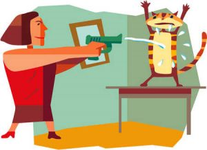

# BadKittyNo
- A fun, family oriented game where you shoot water from a water gun whenever your cats try to steal food. 
- Purpose: The purpose of this project is for Guido teach Frank some game development while working on something fun. This in preparation for future projects involving VR development.
- Authors: 
    - Guido Pererira, https://github.com/guidoafp
    - Frank Haolun Li, https://github.com/frankhli843 
# Initial Planning
- Pick the platform you want and switch it before starting.
- Set player settings
    - Set Company name
- Decide the player mode: First Person

# Upcoming Features
- Upload and customize your own cats.
